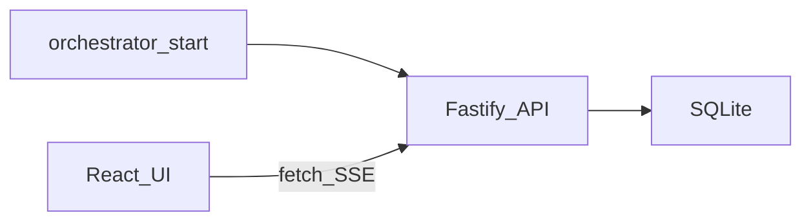

# Architecture

## Components

| Piece | Role |
|-------|------|
| `@orch-os/core` | Shared types, Zod schemas, JSON Schema export (`job-envelope.schema.json`). |
| `@orch-os/api` | Fastify HTTP + SQLite (`better-sqlite3`) + SSE `/api/v1/events` + static UI. |
| `@orch-os/ui` | Vite/React dashboard (same-origin API). |
| `@orch-os/cli` | `start`, `url`, `doctor`, `init`, `job enqueue` / `watch`. |
| `orchestrator-plugins` (Python) | Optional validators / subprocess gates. |

## Data flow (default)

- **Jobs** persist in SQLite (`jobs`, `workers` tables).
- **Live UI** subscribes to **SSE**; the API emits `job_created` / `job_updated` on mutations.
- **STATUS.md** is regenerated on job writes (path from `orchestrator.config.yaml`).

## Instance file (agent discovery)

After `orchestrator start`, **`.orchestrator/instance.json`** contains:

- `baseUrl`, `port`, `pid`, `startedAt`, `instanceToken`, optional `apiKey`.

The file is **gitignored**. On the next `start`, the CLI **SIGTERM**s the previous **recorded PID** when still alive, then binds a port in **`45200–45499`** (or `ORCHESTRATOR_PORT`, or `--port`).

### `--steal-port` / `ORCHESTRATOR_STEAL_PORT=1`

Best-effort **`lsof` + SIGTERM** on listeners (macOS/Linux). This can affect **non-orchestrator** processes — keep off unless you understand the risk.

## Redis

`REDIS_URL` is reserved for an optional **scale** profile. The current build **does not** fan out work to Redis; it only prints a stderr notice. Prefer **SQLite + single API process** for the default path.

## Security

- Default bind: **127.0.0.1**.
- Optional **`x-api-key`** when `ORCHESTRATOR_API_KEY` / `instance.json` includes `apiKey`.
- Treat the dashboard as **local dev tooling**, not a public multi-tenant service.

## Contract versioning

`contractVersion` on jobs aligns tri-tier **FE/BE** contracts; bump when `INTERFACE_CONTRACT.md` / `PREDICTIVE_MAP.json` change under approval workflows.
